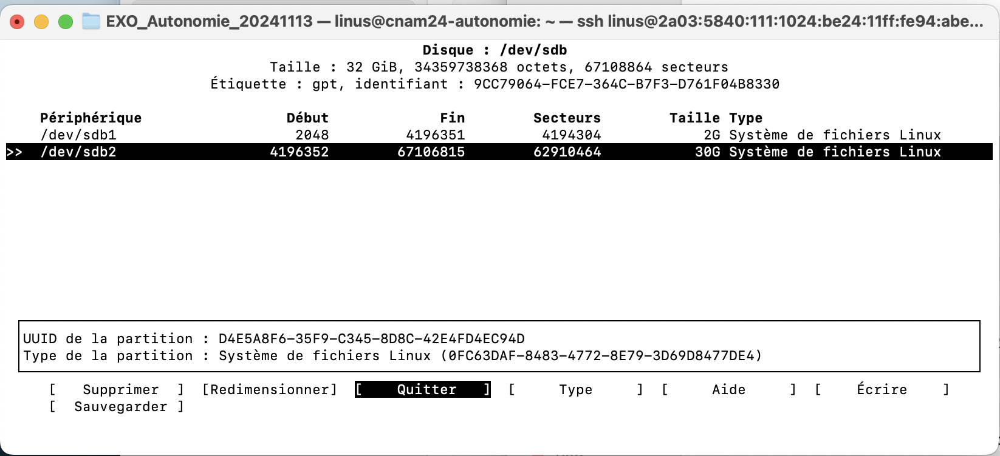

# Documentation exercice en Autonomie

## Prérequis

Tout ne fonctionne qu'en IPv6 

- Soit le réseau du CNAM est en IPv6
- Soit vous créez un Tunnel
  - Aide [TunnelBrocker](TunnelBrocker.md) **Gratuit**
  - Aide [NetAssist :: IPv6 Tunnel Broker](./tb.netassist.ua.md) **Gratuit**
  - Liste des TB [tunnelbroker.services](https://tunnelbroker.services/) (⚠️ payants)
  - Exemple de VPN compatible IPv6 [AirVPN](https://airvpn.org/)
- Soit être en partage de connexion

## Tâches à faire

- Sur cette VM, il y a un disque non partitionné/formaté de 32Go

        - Il faudra donc créer une partition, puis la formater et la monter.

- Installez sur cette VM Debian (faites le maximum) :

    - [x] Un Blog CNAM24 (1 login/mdp pour chaque étudiant)
    - [x] Un Forum CNAM24 (1 login/mdp pour chaque étudiant)
    - [x] Un Wiki CNAM24 (1 login/mdp pour chaque étudiant)
    - [ ] Un etherpad CNAM24
- Rendez tout ces services accessibles sur :
        - http://autonomie.cfai24.ajformation.fr/cnam24/[blog,wiki,forum,pad]
        - Avec une page d'index sur http://autonomie.cfai24.ajformation.fr/cnam24/

# TP

## Connexion à la machine virtuelle

Nous avons choisi d'utiliser des pc ou mac sur un partage de connexion.

Dans un terminal, nous rentrons la commande : 

`ssh linus@2a03:5840:111:1024:be24:11ff:fe94:abe2`

Faire yes puis rentrer le mot de passe.

Nous sommes connectés : 


## Partitionnement du disque

Commandes utilisées pour partitionner le disque : 

- `cfdisk /dev/sdb/`

    

    

    

    

    Puis

- `mkfs.ext4 /dev/sdb2`

    Enfin

- `mount /dev/sdb2 /mnt/sdb2`

## Installation du service Apache2

- `apt-get install apache2`

    On vérifie que le service est actif

- `systemctl status apache2`

Résultat :


## Installation de Mariadb

`apt install mariadb-server`

- Création d'un utilisateur pour mariadb

    `mysql -u root -p`

    ```
    MariaDB [(none)]> CREATE DATABASE myDatabase;
    MariaDB [(none)]> CREATE USER 'cnam24'@'localhost' IDENTIFIED BY 'cnam24';
    MariaDB [(none)]> GRANT ALL PRIVILEGES ON *.* TO 'cnam24'@'localhost' WITH GRANT OPTION;
    MariaDB [(none)]> FLUSH PRIVILEGES;
    ```

## Installation de php

- Installation de php et de tous les modules nécessaires pour le forum

    `apt install php php-cli libapache2-mod-php`

    `apt install php-{curl,gd,intl,memcache,xml,zip,mbstring,json}`

    `apt install php-mysql`

    `php -v`

## Configuration de l'hote virtuel

`nano nano /etc/apache2/sites-available/cnam24.conf`

```
<VirtualHost *:80>
        #ServerName cnam24.fr

        ServerAdmin webmaster@localhost
        DocumentRoot /var/www/cnam24/
        <Directory />
                Options FollowSymLinks
                AllowOverride None
        </Directory>


        LogLevel info


        ErrorLog ${APACHE_LOG_DIR}/error.log
        CustomLog ${APACHE_LOG_DIR}/access.log combined


</VirtualHost>
```

- Désactiver l'hôte par défaut

    `a2dissite 000-default.conf`

- Activer le nouvel hôte

    `a2ensite cnam24.conf`

- Relancer le serveur

    `systemctl reload apache2`


## Installation du forum mylittleforum

- Clonage du dépot public mylittleforum

    `apt install git`

    `git clone https://github.com/My-Little-Forum/mylittleforum.git`

- Copie des fichiers vers /mnt/sdb2/www

    `mkdir /mnt/sdb2/www`

    `cp -r ~/mylittleforum /mnt/sdb2/www`
    
- Gestion des permissions

    `cd /mnt/sdb2/www/mylittleforum`

    `chown -R www-data:www-data ./`

    `chmod -R 750 ./`

- Création d'un lien symbolique

    `ln -s /mnt/sdb2/www/ cnam24`

- Redémarrage du serveur

    `systemctl reload apache2`

- Ouvrir un navigateur et se rendre à l'url http://autonomie.cfai24.ajformation.fr/mylittleforum/install

    

- Sélectionner French puis cliquer sur OK

- Remplir tous les champs du formulaire d'installation

    

    

    Pour la base de données, il faut remplir les champs avec le nom de la base et de l'utilisateur créé au préalable.

    

    Et pour terminer, cliquer sur "OK - Installer le forum"

    

- Si des erreurs se produisent, ou si une page blanche apparait, ne pas hésiter à aller voir les logs d'apache pour voir ce qu'il se passe:

    `more /var/log/apache2/error.log`

- Le forum est maintenant accessible à cette adresse http://autonomie.cfai24.ajformation.fr/mylittleforum/

## Ajout des autres pages

`git clone https://github.com/CNAM2024/Public.git`

`cp -r ~/Public/CNAM24/ /mnt/sdb2/www/`

- L'ensemble du site est désormais disponible ici: http://autonomie.cfai24.ajformation.fr/CNAM24/